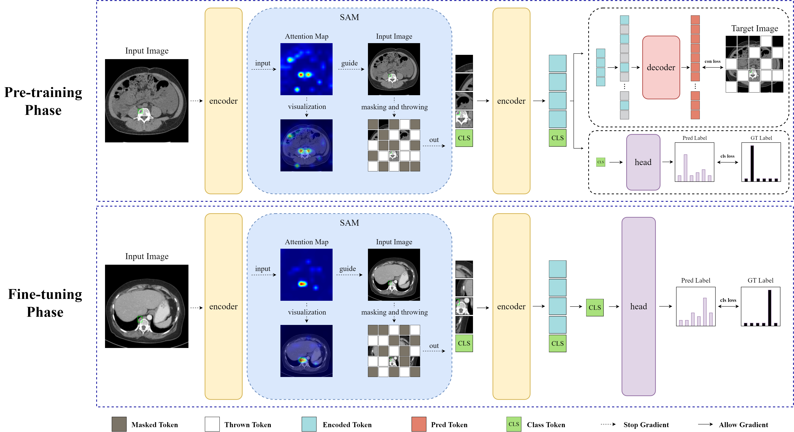
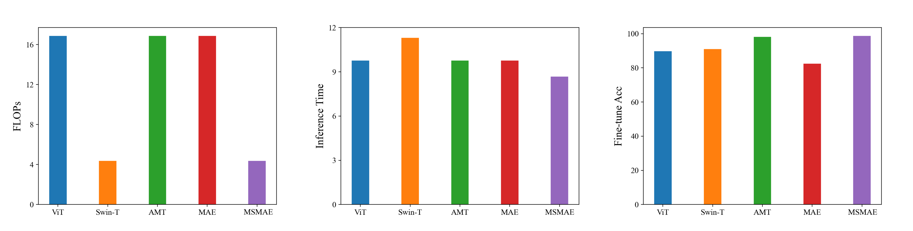
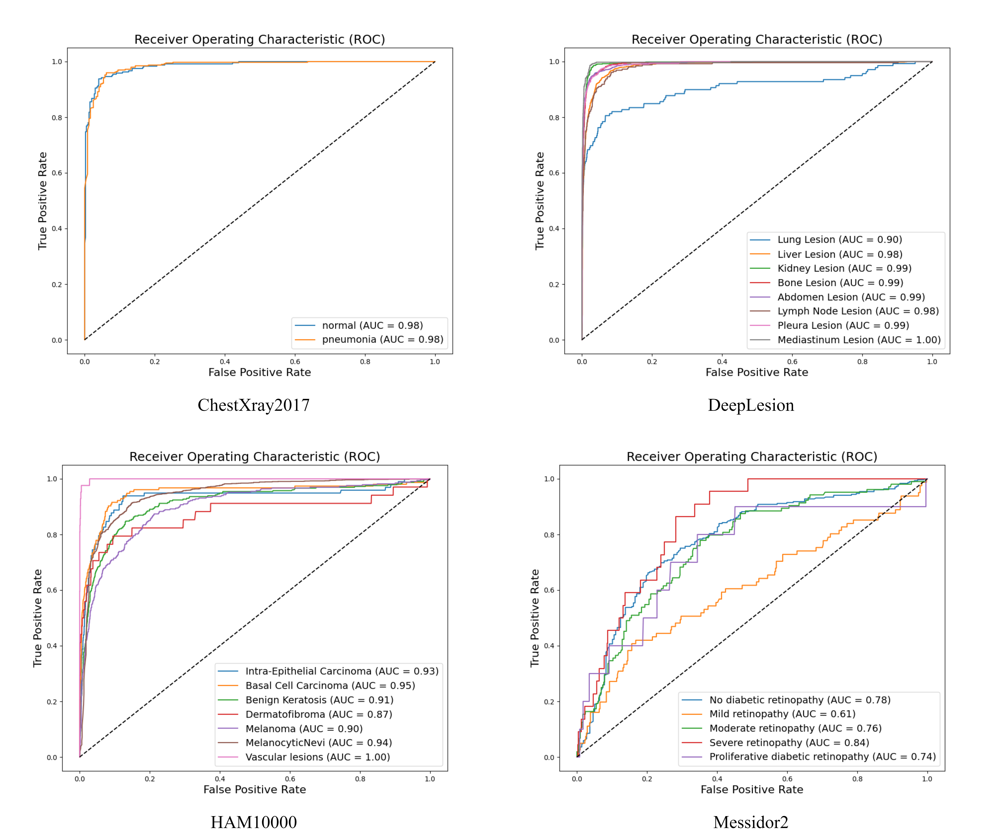
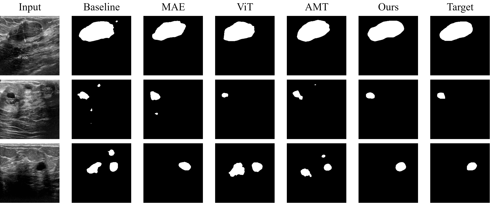

# Medical supervised masked autoencoders: Crafting a better masking strategy and efficient fine-tuning schedule for medical image classification

<span>
<a href="https://arxiv.org/abs/2305.05871"></a>
<a href="https://opensource.org/licenses/MIT"></a>
</span>

This repository contains PyTorch implementation of MSMAE.  

## Introduction 

> Recently, masked autoencoders (MAEs) have displayed great potential in many visual tasks. However, in medical image classification tasks, most human tissue structures are highly similar, and lesion-related regions often account for such a small portion, which causes MAEs’ high-ratio masking strategies likely to overlook these key regions. Meanwhile, inconsistencies between the pre-training phase and the fine-tuning phase lead to problems such as overfitting that hinder the performance and efficiency of MAEs in medical image classification. To address these issues, a Medical Supervised Masked Autoencoder (MSMAE) is proposed in this paper. Specifically, MSMAE designs a supervised attention-driven masking strategy (SAM). Based on the supervision guidance, MSMAE enables the attention map to localize lesion related areas in medical images accurately. SAM performs accurate masking of medical images through attention maps thereby enabling effective learning of human tissue representations of key lesion areas. Additionally, MSMAE’s expansion of SAM to the fine-tuning stage effectively solves the inconsistency issue between the pre-training and fine-tuning stages of MAEs, which also indirectly increases MSMAE’s attention to secondary lesion areas. Extensive experiments have shown that MSMAE achieves SOTA performance on several official medical datasets for various diseases. Specifically, MSMAE achieves 68.41%, 98.39%, 81.97%, 89.59%, and 99.60% medical image classification accuracies on several datasets such as Messidor-2, BTMD, HAM10000, DeepLesion, and ChestXRay2017, respectively. Moreover, transfer learning for MSMAE demonstrates the promise of MSMAE in medical semantic segmentation tasks. Compared to MAE, MSMAE has 11.2% faster inference time in the fine-tuning phase and 74.08% lower FLOPs.

<br>



# Preparation 
## Requirements
* Pytorch >= 1.11.0
* Python >= 3.8
* timm == 0.5.4

## Points for Attention 
* We slightly modify the *vision_transfomer.py* in *timm.models* to provide attention map during pretraining:
```python 
class Attention(nn.Module):
...
   def  __init__(self):
        self.attn = None
...
   def return_attn(self):
        return self.attn 
...
   def get_attn(self, attn):
        self.attn = attn
...
   def forward(self, x):
        B, N, C = x.shape
        qkv = self.qkv(x).reshape(B, N, 3, self.num_heads, C // self.num_heads).permute(2, 0, 3, 1, 4)
        q, k, v = qkv[0], qkv[1], qkv[2]   # make torchscript happy (cannot use tensor as tuple)

        attn = (q @ k.transpose(-2, -1)) * self.scale
        attn = attn.softmax(dim=-1)
        attn = self.attn_drop(attn)
        self.get_attn(attn)
        x = (attn @ v).transpose(1, 2).reshape(B, N, C)
        x = self.proj(x)
        x = self.proj_drop(x)
        return x
```

* We only support ViT-B/16 now.

## Datasets

If you would like to reproduce the results of our paper, please download our randomly split dataset below.

1) Messidor2 - [Link](https://drive.google.com/file/d/1y4zAaOiLg7EHC5J3W05o_hvOcIuPRuRK/view?usp=sharing)
2) BTMD - [Link](https://drive.google.com/file/d/1cAU7d37C_qfxTDdc6kWRg09W19XstMz2/view?usp=sharing)
3) HAM10000 - [Link](https://drive.google.com/file/d/1d3ZdOiDhlH7ghPy7Ze_NoKFffwKE6BRM/view?usp=sharing)
4) DeepLesion - [Link](https://nihcc.app.box.com/v/DeepLesion)
5) ChestXRay2017 - [Link](https://data.mendeley.com/public-files/datasets/rscbjbr9sj/files/f12eaf6d-6023-432f-acc9-80c9d7393433/file_downloaded)
6) BUSI - [Link](https://drive.google.com/file/d/1AzTZcrS_3SdvIMoPodN3iIa5BGK-xcpb/view?usp=sharing)

If you want to train yourself, please split the dataset according to the settings in our appendix to reproduce our experimental results,
and please download, and organize the datasets in this structure:
```
/path/to/imagenet/
  train/
    class1/
      img1.jpeg
      ...
    class2/
      img2.jpeg
      ...
  val/
    class1/
      img3.jpeg
      ...
    class/2
      img4.jpeg
      ...
```

**Trained Model:**

| Dataset   | Model        | Fine-tune Acc      | Pretrained Model    | Fintune Model    |
| :-------- | :----------: |:-----------------: |:-------------------:|:----------------:|
| Messidor2 | MSMAE       | 63.41%             | [Google Drive](https://drive.google.com/file/d/1RcJPe_vpnymNcbjOSh6r1huIH89oc-xF/view?usp=sharing) | [Google Drive](https://drive.google.com/file/d/1HuN54R15mPPbeoLy24PRtNzbzIYEuTWw/view?usp=sharing) |
| BTMD      | MSMAE       | 98.39%             | [Google Drive](https://drive.google.com/file/d/1MKCYeG0mPDPAZ2Pjo1sOCagn4Q4puyr-/view?usp=sharing) | [Google Drive](https://drive.google.com/file/d/1FkMG9HS-juDauEGsJLjnqWS4Tvh8itX7/view?usp=sharing) |
| HAM10000  | MSMAE       | 81.97%             | [Google Drive](https://drive.google.com/file/d/1fF6XctQl4swZK85_wSpqecppZbS5zJNj/view?usp=sharing) | [Google Drive](https://drive.google.com/file/d/1b_zScaQcURp-krWyf-6e35melO9uNfJ4/view?usp=sharing) |
| DeepLesion  | MSMAE       | 89.59%             | [Google Drive](https://drive.google.com/file/d/1-kTUgu28San09Xz5xs7jhJNCFyoRS3SN/view?usp=sharing) | [Google Drive](https://drive.google.com/file/d/1KSvgWVYUFjD3i6mtcGJnJqUbIVRDBbR7/view?usp=sharing) |
| ChestXRay2017  | MSMAE       | 99.60%             | [Google Drive](https://drive.google.com/file/d/14yNC_oT_Pg2yoeq1sTc7lZZmu4y8ALj6/view?usp=sharing) | [Google Drive](https://drive.google.com/file/d/10hdsdQsw8otFp5OSVmb60wVDHXdD7dXz/view?usp=sharing) |
| BUSI      | MSMAE       | 77.68%             | [Google Drive](https://drive.google.com/file/d/1CHj0u8d3EAnSjykkmI7FokE3o0Ns458y/view?usp=sharing) | [Google Drive](https://drive.google.com/file/d/1_MbSJSHt5ioDBw5G3I_tlRzZ2KXhiDyk/view?usp=sharing) |

We test on a single gpu.

## Pre-training with MSMAE
```
python main_pretrain.py \
    --model msmae_vit_base_patch16 \
    --batch_size 64 \
    --mask_ratio 0.45 \
    --throw_ratio 0.3 \
    --num_classes ${Dataset Class Num} \
    --data_path ${Dataset_DIR}
```

## Fine-tuning with MSMAE

```
python main_finetune.py \
    --model vit_base_patch16 \
    --batch_size 256 \
    --mask_ratio 0.45 \
    --throw_ratio 0.3 \
    --finetune ${Pretrained Checkpoint Path} \
    --num_classes ${Dataset Class Num} \
    --data_path ${Dataset_DIR}
```

## Segmentation with MSMAE

For MSMAE to perform medical semantic segmentation tasks please see the [Segmentation Readme](./segmentation/README.md) .

ATTN: This package is free for academic usage. You can run it at your own risk. 

# Results

## Efficiency



## ROC Curve



## Segmentation



## TSNE


## Citation

```
@misc{mao2023medicalsupervisedmaskedautoencoders,
      title={Medical supervised masked autoencoders: Crafting a better masking strategy and efficient fine-tuning schedule for medical image classification}, 
      author={Jiawei Mao and Shujian Guo and Yuanqi Chang and Xuesong Yin and Binling Nie},
      year={2023},
      eprint={2305.05871},
      archivePrefix={arXiv},
      primaryClass={cs.CV},
      url={https://arxiv.org/abs/2305.05871}, 
}
```
